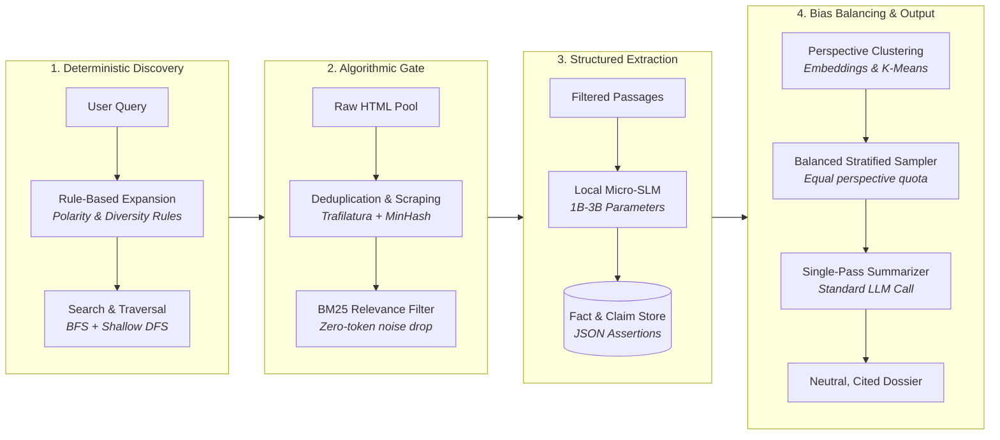
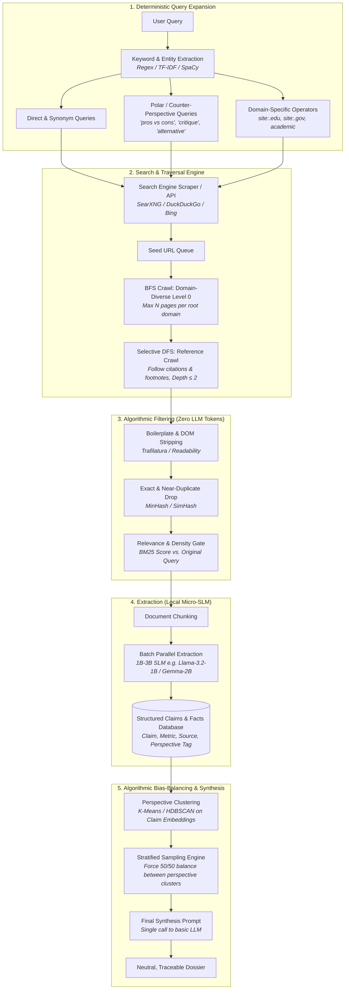

##Engine Architecture

#High level diagram

```mermaid
flowchart LR
    subgraph S1["1. Deterministic Discovery"]
        direction TB
        Q["User Query"] --> EXP["Rule-Based Expansion<br/><i>Polarity & Diversity Rules</i>"]
        EXP --> CRAWL["Search & Traversal<br/><i>BFS + Shallow DFS</i>"]
    end

    subgraph S2["2. Algorithmic Gate"]
        direction TB
        RAW["Raw HTML Pool"] --> CLEAN["Deduplication & Scraping<br/><i>Trafilatura + MinHash</i>"]
        CLEAN --> GATE["BM25 Relevance Filter<br/><i>Zero-token noise drop</i>"]
    end

    subgraph S3["3. Structured Extraction"]
        direction TB
        TEXT["Filtered Passages"] --> SLM["Local Micro-SLM<br/><i>1B-3B Parameters</i>"]
        SLM --> DB[("Fact & Claim Store<br/><i>JSON Assertions</i>")]
    end

    subgraph S4["4. Bias Balancing & Output"]
        direction TB
        EMB["Perspective Clustering<br/><i>Embeddings & K-Means</i>"] --> BAL["Balanced Stratified Sampler<br/><i>Equal perspective quota</i>"]
        BAL --> LLM["Single-Pass Summarizer<br/><i>Standard LLM Call</i>"]
        LLM --> OUT["Neutral, Cited Dossier"]
    end

    S1 --> S2
    S2 --> S3
    S3 --> S4
```

#Detailed Diagram

```mermaid
flowchart TD
    subgraph Phase1["1. Deterministic Query Expansion"]
        A["User Query"] --> B["Keyword & Entity Extraction<br/><i>Regex / TF-IDF / SpaCy</i>"]
        B --> C1["Direct & Synonym Queries"]
        B --> C2["Polar / Counter-Perspective Queries<br/><i>'pros vs cons', 'critique', 'alternative'</i>"]
        B --> C3["Domain-Specific Operators<br/><i>site:.edu, site:.gov, academic</i>"]
    end

    subgraph Phase2["2. Search & Traversal Engine"]
        C1 --> D["Search Engine Scraper / API<br/><i>SearXNG / DuckDuckGo / Bing</i>"]
        C2 --> D
        C3 --> D
        D --> E["Seed URL Queue"]
        E --> F["BFS Crawl: Domain-Diverse Level 0<br/><i>Max N pages per root domain</i>"]
        F --> G["Selective DFS: Reference Crawl<br/><i>Follow citations & footnotes, Depth &le; 2</i>"]
    end

    subgraph Phase3["3. Algorithmic Filtering (Zero LLM Tokens)"]
        G --> H["Boilerplate & DOM Stripping<br/><i>Trafilatura / Readability</i>"]
        H --> I["Exact & Near-Duplicate Drop<br/><i>MinHash / SimHash</i>"]
        I --> J["Relevance & Density Gate<br/><i>BM25 Score vs. Original Query</i>"]
    end

    subgraph Phase4["4. Extraction (Local Micro-SLM)"]
        J --> K["Document Chunking"]
        K --> L["Batch Parallel Extraction<br/><i>1B-3B SLM e.g. Llama-3.2-1B / Gemma-2B</i>"]
        L --> M[("Structured Claims & Facts Database<br/><i>Claim, Metric, Source, Perspective Tag</i>")]
    end

    subgraph Phase5["5. Algorithmic Bias-Balancing & Synthesis"]
        M --> N["Perspective Clustering<br/><i>K-Means / HDBSCAN on Claim Embeddings</i>"]
        N --> O["Stratified Sampling Engine<br/><i>Force 50/50 balance between perspective clusters</i>"]
        O --> P["Final Synthesis Prompt<br/><i>Single call to basic LLM</i>"]
        P --> Q["Neutral, Traceable Dossier"]
    end
```

