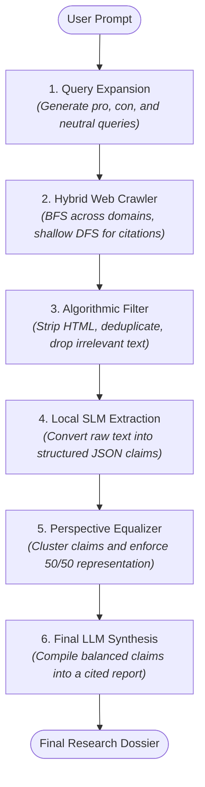

## Engine Architecture

# High level diagram

```mermaid
flowchart TD
    Input(["User Prompt"]) --> Expand["1. Query Expansion<br><i>(Generate pro, con, and neutral queries)</i>"]
    
    Expand --> Crawl["2. Hybrid Web Crawler<br><i>(BFS across domains, shallow DFS for citations)</i>"]
    
    Crawl --> Filter["3. Algorithmic Filter<br><i>(Strip HTML, deduplicate, drop irrelevant text)</i>"]
    
    Filter --> Extract["4. Local SLM Extraction<br><i>(Convert raw text into structured JSON claims)</i>"]
    
    Extract --> Balance["5. Perspective Equalizer<br><i>(Cluster claims and enforce 50/50 representation)</i>"]
    
    Balance --> Synth["6. Final LLM Synthesis<br><i>(Compile balanced claims into a cited report)</i>"]
    
    Synth --> Output(["Final Research Dossier"])
```
