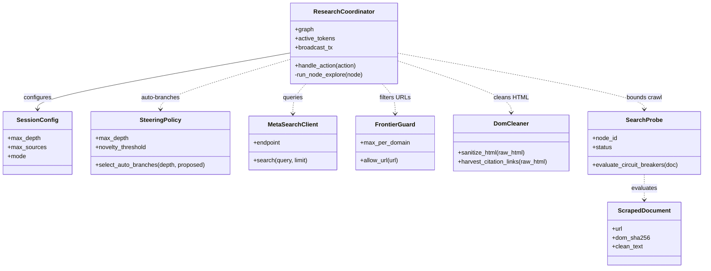

# `ddr-engine` & `ddr-crawler` Boilerplate Flow

Focused runtime diagram for the scoped implementation (`crates/ddr-engine` and `crates/ddr-crawler`).

```mermaid
flowchart LR
    direction TB
    Action["ClientAction: Start / Explore / Probe / Prune"] --> Handle["ddr-engine: ResearchCoordinator::handle_action"]

    Handle -->|"Prune"| Cancel["Cancel active_tokens -> NodeStatus::Pruned -> EngineBroadcast::NodePruned"]
    Handle -->|"Start / Explore / Probe"| Spawn["spawn_nfode_explore (per-node CancellationToken)"]

    Spawn -->|"tokio::select! cancelled"| Cancelled["Abort task cleanly"]
    Spawn -->|"run_node_explore"| Searching["1. NodeStatus::Searching (NodeUpdated)"]

    Searching --> Search["ddr-crawler: MetaSearchClient::search"]
    Search --> Frontier["ddr-crawler: FrontierGuard::allow_url (dedup + domain cap)"]
    Frontier --> Scraping["2. NodeStatus::Scraping (NodeUpdated)"]

    Scraping --> Fetch["Async HTTP Fetch (reqwest)"]
    Fetch --> Clean["ddr-crawler: DomCleaner::sanitize_html -> clean_text + dom_sha256"]
    Clean --> Harvest["ddr-crawler: DomCleaner::harvest_citation_links (optional depth-1 hop)"]
    Harvest --> Doc["Build ScrapedDocument + SourceMetadata"]
    Doc --> Breaker{"ddr-crawler: SearchProbe::evaluate_circuit_breakers"}

    Breaker -->|"Continue"| Fetch
    Breaker -->|"Terminal / Quota / Drift / Saturated / MaxDepth"| Complete["3. NodeStatus::Complete -> Update KnowledgeGraph -> NodeUpdated"]
```

## Simplified Class Diagram

```mermaid
classDiagram
    class ResearchCoordinator {
        +graph
        +active_tokens
        +broadcast_tx
        +handle_action(action)
        -run_node_explore(node)
    }

    class SessionConfig {
        +max_depth
        +max_sources
        +mode
    }

    class SteeringPolicy {
        +max_depth
        +novelty_threshold
        +select_auto_branches(depth, proposed)
    }

    class MetaSearchClient {
        +endpoint
        +search(query, limit)
    }

    class FrontierGuard {
        +max_per_domain
        +allow_url(url)
    }

    class DomCleaner {
        +sanitize_html(raw_html)
        +harvest_citation_links(raw_html)
    }

    class SearchProbe {
        +node_id
        +status
        +evaluate_circuit_breakers(doc)
    }

    class ScrapedDocument {
        +url
        +dom_sha256
        +clean_text
    }

    ResearchCoordinator --> SessionConfig : configures
    ResearchCoordinator ..> SteeringPolicy : auto-branches
    ResearchCoordinator ..> MetaSearchClient : queries
    ResearchCoordinator ..> FrontierGuard : filters URLs
    ResearchCoordinator ..> DomCleaner : cleans HTML
    ResearchCoordinator ..> SearchProbe : bounds crawl
    SearchProbe ..> ScrapedDocument : evaluates
```
